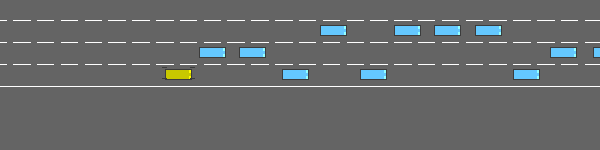

# LFF-DS

Official Implementation of our paper _Learned Fourier Bases for Deep Set Feature Extractors in Automotive Reinforcement Learning_.
You can find the draft version [here](http://www.tnt.uni-hannover.de/papers/data/1680/LFF-DS.pdf). This repository will be updated with a link to the final version once published by IEEE.

> Neural networks in the automotive sector commonly have to process varying number of objects per observation. 
Deep Set feature extractors have shown great success on problems in reinforcement learning with dynamic observations, achieving state-of-the-art performance on common tasks like highway driving.
However, recent work has shown that neural networks suffer from a spectral bias, fitting to low frequencies of scalar features used in such representations, like velocities and distances.
We introduce a novel set feature extractor combining learned Fourier features with the Deep Set architecture. 
The proposed architecture reduces this spectral bias allowing more sample-efficient training and better performance by learning a more detailed representation.
Extensive experiments are conducted on three different environments, including two novel environments featuring a large number of objects in challenging random scenarios.
Our method outperforms state-of-the-art approaches and exceeds the performance of existing Deep Set architectures on these challenging new tasks.

## Videos

### Country Road
Navigating a tightly winding road with slippery surface using a dynamic vehicle model:


## Parking
Parking into a spot parallel to the road using a kinematic vehicle model:


## Highway
Overtaking vehicles on the [highway-env](https://github.com/Farama-Foundation/HighwayEnv) environment:



## Installation

We recommend installing to a new conda environment:

```shell
conda create -n lffds python=3.8 pytorch==1.12.1 torchvision==0.13.1 torchaudio==0.12.1 cudatoolkit=11.3 -c pytorch
conda activate lffds
pip install -e CarEnv
pip install -r requirements.txt
```

## Running the experiments

Execute `train.py` to repeat experiments from our paper.
The following parameters are available to configure training including the competitors used:

Argument | Description
---|---
`problem` | Either `country`, `parking` or `highway`, depending on the problem to train on.
`extractor` | One of `cnn`, `flat`, `deepset`, `lffds` to select an architecture from the paper, where `lffds` is ours.
`gamma` | Discount factor $\gamma$, defaults to value from paper.
`steps` | Gradient steps, defaults to value from paper.
`eval_frequency` | Gradient steps between evaluation, defaults to value from paper.

Please note that we have used [W&B](https://wandb.ai/) for logging, so you may require an account to log output without modifications to the code.

## Citing

Please cite this work as:

```bibtex
@inproceedings { SchRei2023b,
  author = {Maximilian Schier and Christoph Reinders and Bodo Rosenhahn},
  title = {Learned Fourier Bases for Deep Set Feature Extractors in Automotive Reinforcement Learning},
  booktitle = {2023 IEEE 26th International Conference on Intelligent Transportation Systems (ITSC)},
  year = {2023},
  month = sep,
  pages = {to appear}
}
```